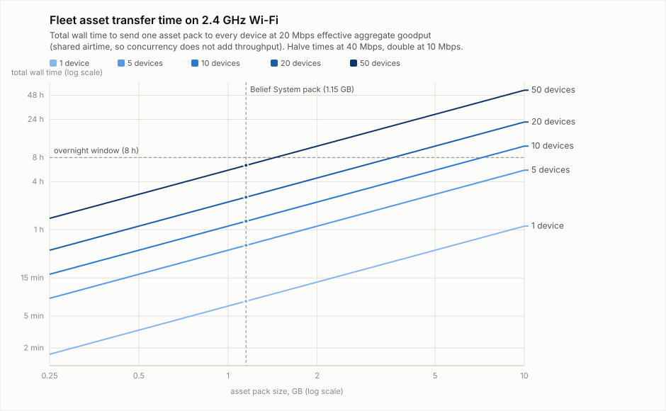

# Asset scale and 2.4 GHz transfer-time reference

Planning numbers for asset distribution: measured pack size, effective
throughput on the installation network, wall-time estimates by pack size and
fleet size, and hashing cost on the node hardware. Estimates here are
back-of-envelope planning figures; replace them with measurements from the
real rig before committing to fleet-scheduler machinery.

## Measured pack size

- **Belief System complete asset folder: 1.15 GB** (Bob, measured 2026-07-15).
- Expectation: most bopOS asset packs will sit **well under 5 GB**.
- The earlier 10–50 GB working premise in the 2026-07-15 asset-management
  decision record is **superseded for planning defaults**. Very large loads
  remain possible but exceptional, and are better served by USB/SD physical
  seeding than by network-distribution machinery sized for them.

## Throughput assumptions (2.4 GHz, the normal case)

The fleet is Pi Zero 2 W: 802.11n, 2.4 GHz only, single antenna, single
stream, 20 MHz channel — PHY ceiling 72.2 Mbps (MCS7). Realistic TCP goodput:

| Condition | Effective aggregate goodput |
|---|---|
| Clean RF, close to AP, one receiver | 25–40 Mbps |
| Installation-typical (the planning default) | **~20 Mbps** |
| Congested/far/interference, venue Wi-Fi | ~10 Mbps |

Two structural facts dominate:

1. **Airtime is shared.** Sending to N devices concurrently does not multiply
   throughput — total wall time ≈ total bytes ÷ aggregate goodput whether
   transfers run sequentially or in parallel on one access point. A simple
   bounded/sequential loop costs almost no wall time versus concurrency and
   is far easier to reason about.
2. **Wi-Fi is the bottleneck.** SD sequential write (~10–25 MB/s ≈ 80–200
   Mbps) and inline SHA-256 verification (~40–60 MB/s on the Zero 2 W's
   Cortex-A53, which lacks ARMv8 crypto extensions) both outrun a ~2.5 MB/s
   radio, so per-file verification during fetch is effectively free.

## Estimate formula

```text
minutes ≈ pack_GB × devices × 8000 / Mbps / 60
```

At 20 Mbps: **6.7 minutes per GB per device**. Times scale inversely with
goodput: halve them at 40 Mbps, double them at 10 Mbps.

## Wall-time table (20 Mbps effective aggregate)

| Pack size | 1 device | 5 devices | 10 devices | 20 devices | 50 devices |
|---|---|---|---|---|---|
| 0.25 GB | 1.7 min | 8.3 min | 17 min | 33 min | 1.4 h |
| 0.5 GB | 3.3 min | 17 min | 33 min | 1.1 h | 2.8 h |
| 1 GB | 6.7 min | 33 min | 1.1 h | 2.2 h | 5.6 h |
| **1.15 GB** (Belief System) | **7.7 min** | **38 min** | **1.3 h** | **2.6 h** | **6.4 h** |
| 2 GB | 13 min | 1.1 h | 2.2 h | 4.4 h | 11 h |
| 5 GB | 33 min | 2.8 h | 5.6 h | 11 h | 28 h |
| 10 GB | 1.1 h | 5.6 h | 11 h | 22 h | 56 h |



The chart (`transfer-times.svg`, regenerate with `python3 make_chart.py`)
plots the same model log-log with the Belief System pack and an 8-hour
overnight window marked. Reading it: **a measured-scale pack (~1.15 GB)
reaches a 50-device fleet inside one evening, and a 2 GB pack reaches 20
devices in ~4.4 h** — a naive sequential loop is enough. Only the
superseded-premise corner (≥5 GB × ≥20 devices) crosses into multi-day
territory where seeding and scheduling machinery would earn its keep.

## Fingerprint hashing cost on the node

Computing a slot's canonical directory-manifest fingerprint from cold reads
and hashes every byte: SD sequential read ~20–40 MB/s and SHA-256 ~40–60 MB/s
on the Zero 2 W give roughly **30–60 s per GB, cold** — a 1.15 GB slot is
about a minute; 5 GB is several. This is why the device asset inventory
(`/os/assets`) must never hash synchronously in the query path: fingerprints
come from a stat-signature-guarded persistent cache, seeded for free at fetch
completion (the fetcher has just verified every file hash) and re-hashing
only files whose stat signature changed (`python/identity.py` already does
exactly this in memory for `/os/patches`).

## Design consequences (folded into the loom 2026-07-15)

- The single-device-first boundary (stitch `11-assets-device-workflow`)
  stays: it is the right product sequencing regardless of scale.
- `free_bytes` is **dropped** from the `/os/assets` inventory seam: at ~1–2 GB
  packs on 16–32 GB cards, side-by-side generations are not a storage event.
- When `asset-fleet-distribution` resumes, it starts from this reference, not
  the 10–50 GB premise: the likely sufficient shape is a durable desired-slot
  record plus a bounded sequential loop over the single-device path, with the
  heavier machinery (waves, caches, packfiles, P2P, multicast) gated on
  measurements from the real rig.
- Node-local stage-and-swap for live-slot updates is contract-compatible
  (§7: WHAT is fixed, HOW is the node's) and independent of fleet design;
  kept as optional hardening stitch `11c`.
