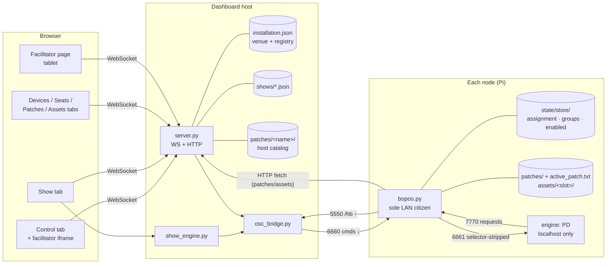
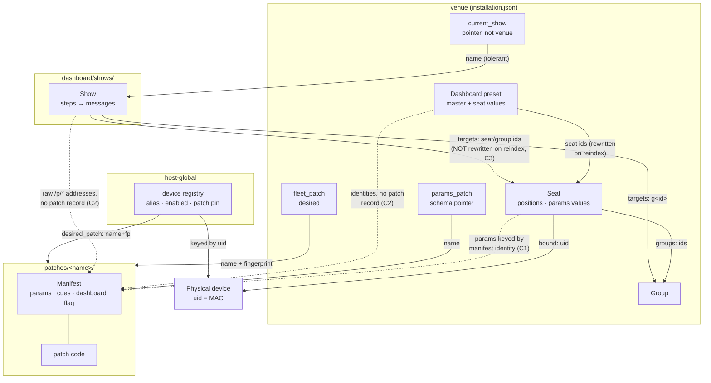

# bopOS entity map — the system as it is (2026-07-27)

Stitch `entity-architecture-review/1-system-map`. Descriptive only: this maps
what exists in the code today, as ground truth for the workflow walkthroughs
and simplification proposal (`2-workflows-and-simplification`) and for the
preset-primitive design (`41`). Sources are cited per section; the wire truth
is `docs/OSC-CONTRACT.md` (v1.13).

---

## 1. Summary overview

bopOS is **one dashboard host and a fleet of autonomous nodes** speaking OSC
over the installation LAN. Everything the system knows lives in one of five
places:

1. **The node's own disk** — who it is and what it needs to run alone:
   its seat assignment, group membership, enabled flag, its copy of each
   patch and asset pack, and which patch is active. A node keeps working
   with the dashboard gone.
2. **`dashboard/installation.json`** — the *venue*: seats, groups, room,
   listener, per-seat parameter values, dashboard presets, the staged fleet
   patch, and pointers (`params_patch`, `current_show`).
3. **The host device registry** (inside `installation.json` but host-global,
   deliberately excluded from venue snapshots) — per physical box: alias,
   enabled intent, optional per-device patch pin.
4. **The patch folder** (`patches/<name>/`) — the patch's code plus its
   manifest (`bopos.patch.json`), which declares engine, entrypoint, params,
   and cues. Content identity is a canonical sha256 fingerprint.
5. **The show folder** (`dashboard/shows/<name>.json`) — sequenced steps of
   OSC messages with selector-list targets.

The load-bearing idea throughout: **desired state is stored, observed state
is reported, and convergence is derived by comparing them** — never stored
as a verdict. The fleet patch is desired; the node's `/os/patches` listing is
observed; the badge (`current`/`stale`/`missing`…) is recomputed on every
broadcast. Device enabled works the same way (registry intent vs heartbeat
observation), as does distribution (host fingerprint vs node receipt).

The second load-bearing idea: **seats are the stable addressing layer.**
Physical boxes (UIDs) come and go; a *seat* is a durable numbered position in
the room that a box is bound to. All content targeting — live controls,
shows, presets, spatial — speaks in seats and groups (`all | <seat-id> |
g<group-id>`), never in UIDs. UIDs appear only on the admin plane
(`/all/os/to <uid> …`) and in the host registry.

Ports (contract §4): `5550` heartbeats fleet→dash; `6660` commands
dash→fleet (`bopos.py` is the node's only LAN citizen); `6661/7770` the
localhost engine seam; `6662/8880` peripheral IO. Address grammar:
`/<selector>/<plane>/<member>` with planes `/os` `/io` `/sync` `/cue` `/pt`
(framework, closed) and `/p/*` (patch-owned, open; numeric params also accept
the §3.2 automation grammar).

---

## 2. The entities

### 2.1 Physical device

| | |
|---|---|
| Identity | `uid` — the primary-interface MAC; stable, opaque, never an address component |
| Node-side storage | `state/store/` one-file-per-key JSON ([store.py](../python/store.py)): `assignment` `[seat_id, name, pos…]`, `groups` `[ids]`, `device_enabled`; plus `bopos.config` (sourced env: mixer/card hints, `LOG_DESTINATION`, audio config), the bopOS git checkout (= `version`), `patches/` + `active_patch.txt`, `assets/<slot>/`, `.hashcache.json` |
| Host-side runtime | `state.devices[uid]` — **never persisted** ([state.py:206](../dashboard/state.py)): online/ip/version/report, `patches` listing, `distribution` acks, `fetch` phases, `patch_switch` attempt, `assets` inventory, `sync` estimate, `params` mirror, enabled observations |
| Host-side durable | `state.device_registry[uid]` ([device_aliases.py](../dashboard/device_aliases.py)): `alias` (generated or custom, e.g. "Finn Jet"), `device_enabled` intent, optional `desired_patch` pin `{name, fingerprint}` |
| Lifetime | Registry entry allocated on first sighting, survives everything host-side; runtime record rebuilt from heartbeats each session. Node store survives reboot; a reflash erases it (unassigned-and-announcing, never silence) |
| Wire | `/hb` on 5550 (~1 Hz, full-state); commands on 6660; exact-UID admin via `/all/os/to <uid> <verb>` |

The registry is **host-global, not venue state**: `save_venue` strips it
([state.py:974](../dashboard/state.py)). Aliases, enabled intent, and patch
pins belong to this dashboard host's relationship with these boxes, not to a
room layout. Virtual devices (`audition-####`) are excluded from the registry
entirely.

### 2.2 Seat

| | |
|---|---|
| Identity | non-negative integer `id`, 0-indexed; unique within the venue |
| Storage | `installation.json → seats[str(id)]`: `{id, name, positions[[x,y]…], groups[ids], bound: uid\|null, params{identity: value}}` |
| Lifetime | operator-created/deleted; survives everything; travels with venues |
| References | `bound` → device **by UID** (one device per seat, enforced); `groups` → group ids; `params` keys → **manifest param identities** (see §3, coupling C1) |
| Wire | assignment delivered by literal `/all/os/assign` (node persists its own mirror and acks); thereafter the seat id **is** the selector |

A seat is a durable position in the room *and* the durable holder of live
parameter values. The node holds a mirror of its own assignment (id, name,
positions) so it self-addresses with the dashboard gone.

### 2.3 Group

| | |
|---|---|
| Identity | int id from a **never-reused allocator** (`next_group_id`, monotonic even across venue loads — [state.py:1049](../dashboard/state.py)) |
| Storage | `installation.json → groups[str(id)] = {id, name}`; **membership lives on seats** (`seat.groups`), mirrored to each node's own store |
| Wire | selector `g<id>`; nodes match locally against persisted membership ([groups.py](../python/groups.py)); engine gets membership in its run context and on change |

### 2.4 Patch + manifest

| | |
|---|---|
| Identity | directory name (strict token grammar) + **content fingerprint**: sha256 of the canonical file-walk manifest ([identity.py](../python/identity.py)) — same code on host and node, so same bytes ⇒ same 64-hex value |
| Storage | host catalog `patches/<name>/`; each node's own `patches/<name>/`, populated by convergent HTTP fetch from the dashboard host with per-file sha256 verification ([fetcher.py](../python/fetcher.py)) |
| Manifest | `bopos.patch.json`, one validator ([manifest.py](../python/manifest.py)): `engine`, `entrypoint`, `params[]` (name+path → slash-joined identity, type `i/f/s`, min/max/default, `dashboard` flag), `cues[]`, `caps`, `slots` |
| Active | node-side pointer `patches/active_patch.txt`; engine relaunch on switch; run context (seed, run_id, version, patch_fingerprint, groups, asset paths) delivered atomically at launch ([runcontext.py](../python/runcontext.py)) |
| Desired | fleet-wide: `installation.json → fleet_patch {name, fingerprint, staged_at, previous}`; per-device: `device_registry[uid].desired_patch` pin overrides the fleet default (thread 37) |
| Convergence | derived badge per device: `current/stale/missing/mismatch/switching/…` ([state.py:60](../dashboard/state.py)), desired-vs-observed, recomputed per broadcast |

**Presets do not exist patch-side today.** The patch folder carries code +
manifest only. (Bob has ruled they *will* live there — thread 41.)

### 2.5 Parameter values, promoted controls, and `params_patch`

Three distinct things share the word "params":

1. **The schema** — the manifest's `params[]` declarations of the patch
   named by `installation.json → params_patch`.
2. **The values** — durable per seat (`seat.params`, keyed by qualified
   identity like `delay/feedback`), mirrored at runtime onto bound devices.
3. **The presentation surfaces** — `live_control_declarations()`
   ([server.py:1465](../dashboard/server.py)) publishes the full schema to the
   shared `control-surface.js`. The desktop Control tab (embedded iframe) and
   Device control panel show every declaration; the standalone facilitator
   page filters that schema to `dashboard: true`.

Schema transitions are explicit: a **patch-name change fully resets** every
seat's values to declared defaults (`reset_fleet_params`); a **same-patch
manifest revision reconciles** — unchanged identities keep values, new ones
get defaults, removed ones are pruned (`reconcile_fleet_params`,
[state.py:849](../dashboard/state.py)). A pinned device gets its declarations
from its pinned patch's manifest instead of the fleet's
([server.py:1619](../dashboard/server.py)).

**Generator/automation state is runtime-only** by design: the §3.2 grammar
rides `/p/*` messages; engines run the generators; the dashboard tracks them
for display but forgets on restart. Nothing durable anywhere records "this
param is running an LFO".

### 2.6 Preset (dashboard-side, today's kind)

| | |
|---|---|
| Identity | sanitized name string |
| Storage | `installation.json → presets[name] = {master, scope, scope_id, seats: {seat_id: {identity: value}}}` ([server.py:791](../dashboard/server.py)) |
| Captures | per-seat param **values** + master. Never positions, assignments, or generator state |
| Scope | recorded from the Control target filter at save (`all`/`groups`/`seat`); load is additionally scoped by the filter the operator is looking at |
| Travels with | the **venue** (included in snapshots) — presets are site-state, not patch-state |
| Couplings | seat ids as keys (rewritten on seat reindex/delete — [state.py:650](../dashboard/state.py)); param identities as keys (**no record of which patch/manifest they came from** — coupling C2) |

### 2.7 Show

| | |
|---|---|
| Identity | filename in `dashboard/shows/<name>.json`; `current_show` in `installation.json` is just a name pointer (tolerant of a missing file, **not** venue state) |
| Storage | `{schema: 1, name, items[]}` — flat ordered mix of `step` and `divider` ([show_model.py](../dashboard/show_model.py)) |
| Step | `{uid, alias, messages[], duration_s, play_count, then_actions[]}`; then-actions give playback flow (stop/next/goto/…) |
| Message | `{uid, alias, address, args[{type,value}], target}` — **target is a selector list** (`all`/`<seat-id>`/`g<id>`), address is a **raw string** (`/p/gain0`, `/c`, anything) |
| Playback | `show_engine.py` walks steps and emits through `OSCBridge`; cues forward-sync with the global `cue_lead_ms` |
| Couplings | targets → seat/group **ids** (C3); addresses → the running patch's param namespace, **entirely implicit** — no patch name, no fingerprint, no drift detection (C2; the ruled future direction adds fingerprint references) |

### 2.8 Room, listener, points, venue, simulation

- **Room + listener**: durable in `installation.json`; top-down metres,
  origin top-left. Spatial is broadcast `/pt` geometry with node-side
  decomposition — never per-device gain streams (seam law).
- **Points**: runtime-only geometry (`state.data["points"]`, excluded from
  `durable()`).
- **Venue**: `dashboard/installations/<name>.json` — a named snapshot of
  durable venue state **minus** `device_registry` and `current_show`. Load
  replaces the venue, rebinds seats to devices by UID (reporting
  rebound/waiting), and keeps the group-id allocator monotonic.
- **Simulation/audition**: `tools/simfleet.py` nodes speak the real protocol
  as virtual devices; excluded from the registry; the patch editor runs an
  `audition-0001` edit instance behind `supervisor.mode`.

---

## 3. The reference graph

Arrows point from the entity holding the reference to the entity it names;
labels give the mechanism.

Solid arrows are **explicit, validated references**. Dotted arrows are
**implicit couplings** — string keys that happen to mean something in
another entity's namespace, with no version/fingerprint record and no
validation at the boundary.

**There are no reference cycles.** The graph is a DAG: device ← seat ←
{preset, show}, patch ← {fleet_patch, pin, params_patch}, and the dotted
manifest couplings all point one way (venue/show → patch). The mess Bob
smells is not loops — it is the **dotted lines** (unversioned implicit
coupling) plus **the same concept expressed in two places** (§4).

---

## 4. Observed tensions (descriptive — proposals belong to stitch 2)

**C1 — seat values are keyed by a schema they don't record.**
`seat.params` identities only mean anything relative to `params_patch`'s
manifest. The reset/reconcile machinery handles transitions correctly, but
the values themselves carry no mark of the schema they belong to; the pairing
is maintained operationally (one venue, one fleet schema at a time) rather
than structurally. Per-device pinned patches already bend this: a pinned
device's *declarations* come from its own patch, but its *values* still live
on the seat in the fleet schema's namespace.

**C2 — presets and shows reference manifests invisibly.**
Dashboard presets and show messages both embed manifest param identities (and
shows, raw addresses) with **no record of patch name or fingerprint**. A
manifest edit or fleet-patch change silently strands them: a stale preset
just half-applies (unknown identities are dropped at load via
`active_param_identities()`); a stale show sends messages nothing consumes
(legal no-op by the seam law, so it fails *silently and musically*, not
loudly). Bob has already ruled the fix direction for 41: fingerprint
references + drift warnings, shared by shows and presets.

**C3 — show targets don't follow seat renumbering.**
`reindex_seat` rewrites preset seat keys transactionally but show documents
are separate files and keep their old numeric targets. Repositioning a seat
is safe (positions are seat-local); renumbering one desynchronizes every show
that targeted it, silently.

**D1 — two preset concepts are about to coexist.**
Today's venue presets (site-state: values + master, scoped by filter) and
thread 41's patch presets (patch-state: values + generator specs, travel with
the patch) answer different questions but share a name and a UI slot. The
migration question is 41's Q8.

**D2 — the same value lives in up to three mirrors.**
Durable truth for a live param is `seat.params`; runtime copies sit on bound
devices and virtual devices (`set_group_param`, `reconcile_fleet_params`
update all of them in lockstep). This is deliberate (offline durability +
per-device display) but it is three writes per change and a standing
invariant to maintain.

**D3 — desired patch state is split across two stores, by design.**
Fleet default in the venue (`fleet_patch`), per-device pin in the host
registry (`desired_patch`). Effective desired = pin else fleet. This was
thread 37's ratified call (a pin is about the *box*, not the room); noted
here because any future "what patch should X run" reasoning must consult
both.

**D4 — one flag currently serves two audiences.**
`dashboard: true` gates both the facilitator's simplified view and the
Control tab's full surface. The 2026-07-27 ruling splits them (Control shows
everything); after that lands, the flag's remaining meaning is purely
"facilitator-visible".

---

## 5. Storage ownership at a glance

| Store | Owner | Holds | Survives |
|---|---|---|---|
| node `state/store/` | node | assignment, groups, enabled | reboot; not reflash |
| node `bopos.config` | node (provision/Device tab) | card/mixer hints, log dest, audio config | reboot |
| node `patches/`, `assets/`, `active_patch.txt` | node (fetch + switch verbs) | content copies + active pointer | reboot |
| `installation.json` (venue part) | dashboard | seats, groups, room, listener, master, presets, fleet_patch, params_patch, cue_lead_ms | restart; replaced by venue load |
| `installation.json → device_registry` | dashboard (host-global) | alias, enabled intent, patch pin | restart **and** venue load |
| `dashboard/installations/*.json` | operator | venue snapshots (no registry, no current_show) | forever |
| `dashboard/shows/*.json` | operator (Show tab) | show documents | forever; `current_show` is just a pointer |
| `patches/<name>/` (host) | Bob / patch editor | code + manifest | forever; identity = fingerprint |
| browser `localStorage` | each browser | UI state incl. the shared Control/facilitator selected-target filter | per browser |
| runtime only | dashboard process | device liveness/observations, points, generator tracking, show playback position | nothing — rebuilt from heartbeats |
