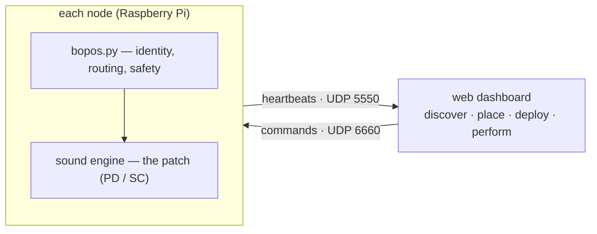

# bopOS

bopOS turns a room full of small speakers into one instrument.

It is a framework for **networked, multi-device sound installations**: a
fleet of Raspberry Pis, each running an autonomous sound patch, coordinated
over Wi-Fi from a web dashboard. The dashboard discovers the boxes, places
them in the room, delivers the music to them, and gives a performer live
control — and once configured, every box keeps playing on its own, with no
network and no laptop present.


## Why it exists

Multi-speaker pieces usually mean either a rack of cables back to one
computer, or a pile of hand-configured players that drift apart. bopOS
takes a third path:

- **Every speaker is a computer** running the piece locally — no audio
  snakes, no single point of failure, and the room itself becomes the
  mixing desk.
- **The fleet behaves like one instrument.** Cues fire together
  (clock-synced over Wi-Fi), moving sound sources sweep across boxes, and
  a master fader and mute cover the whole room.
- **The piece is a folder.** A patch — Pure Data or SuperCollider — plus a
  small manifest declaring its controls. Copy a demo, edit, press deploy.

## How it fits together



One process per node faces the network; the sound engine behind it receives
a clean local surface — parameters, spatial values, synchronized cues — and
decides what they mean musically. The full tour is
[docs/ARCHITECTURE.md](docs/ARCHITECTURE.md).

## Start here

Three routes, depending on who you are today:

| route | for | you'll need |
|---|---|---|
| **[Getting started](docs/GETTING-STARTED.md)** | seeing a working system in ~10 minutes | a laptop with Python |
| **[Composing](docs/COMPOSING.md)** | writing and deploying a piece — no Git required | the above + Pure Data |
| **[Installing a node](docs/INSTALL.md)** | building the physical fleet and its network | a Raspberry Pi + audio board |

## Documentation map

**Guides**

- [Getting started](docs/GETTING-STARTED.md) — the simulated fleet tour
- [Composing](docs/COMPOSING.md) — patch authoring, audition, deployment,
  assets, and the advanced Git workflow
- [Installing a node](docs/INSTALL.md) — flashing, provisioning, the
  travel-router network recipe, updates

**System**

- [How bopOS works](docs/ARCHITECTURE.md) — the architecture in ten minutes
- [Port map](docs/PORTS.md) — every UDP port on one page
- [OSC contract](docs/OSC-CONTRACT.md) — the ratified wire protocol
  (normative)
- [OSC quick reference](docs/OSC-REFERENCE.md) — every message, complete
  and ready to send by hand (no dashboard required)

**Operations & hardware**

- [Dashboard guide](dashboard/README.md) — running the server, flags,
  simulation, venue state, clock measurement
- [Audio hardware onboarding](docs/HARDWARE.md) — benching new boards and
  engine-safe mute
- [I2C peripherals](python/io/README.md) — sensors, buttons, displays
- [Performance measurement](docs/PERF.md) — tuning constrained Pis
- [Verification](docs/VERIFICATION.md) — what "tested" means in this repo

**Reference folders**

- [patches/](patches/README.md) — patch layout, the required manifest, demos
- [assets/](assets/README.md) — asset slots for large media

## Status — July 2026

The software stack is implemented and exercised against a simulated fleet
and real bench hardware: OSC contract v1.7, the engine boundary, clock
sync, spatial terms, the six-tab dashboard, patch/asset distribution, and
unattended updates. Installation-scale hardware verification (rig timing
sweeps, multi-room deployments) continues; claims that depend on it are
labelled honestly where they appear. Current work state lives in
[`.loom/`](.loom/), design records in [`.lore/`](.lore/), and agent
orientation in [CLAUDE.md](CLAUDE.md).

## Repository layout

```text
bash/        boot, engine lifecycle, update, provisioning scripts
dashboard/   FastAPI/WebSocket server and the browser UI
docs/        guides, architecture, and the OSC contract
patches/     installed patches; demo-pd and demo-sc starting points
pd/          bopOS Pure Data adapters and the bop submodule
python/      node service, persistence, sync, spatial math, I2C bridge
tools/       simfleet, audition rig, sync and performance harnesses
assets/      host catalog of asset slots (large media)
.loom/       live work tracker · .notes/ working notes · .lore/ records
```

The [bop](https://github.com/zealtv/bop) Pure Data module library is
included as a submodule.
