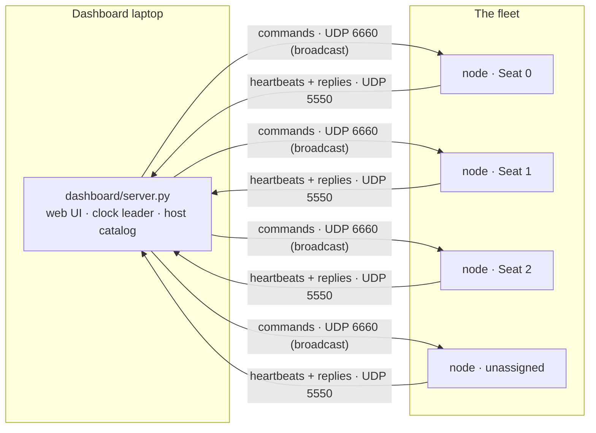
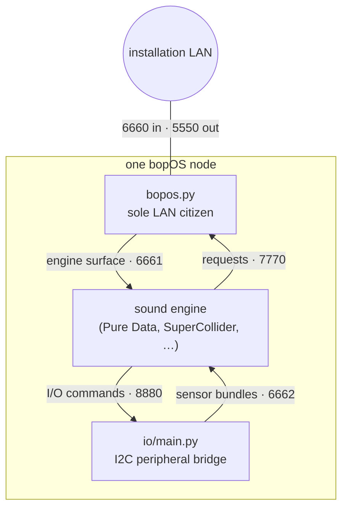

# How bopOS works

A guided tour of the moving parts: what runs where, how messages flow, and
which document owns each detail. Nothing here is normative — the ratified
wire contract is [OSC-CONTRACT.md](OSC-CONTRACT.md), and where this page and
the contract disagree, the contract wins.

**Reading time:** ~10 minutes. If you just want to *use* the system, start
with [Getting started](GETTING-STARTED.md) instead.

## The shape of an installation

A bopOS installation is a fleet of small autonomous computers (usually
Raspberry Pis, one per sound position) and one controlling laptop on the same
Wi-Fi network. The laptop runs the **dashboard**; every node runs the same
bopOS software and plays its part of the piece.



Three properties define the design:

- **Nodes are autonomous.** Once configured, a node keeps playing with no
  dashboard and no network. Dashboard-less operation is a first-class mode,
  not a degraded one — active installations run this way.
- **Discovery is the heartbeat.** Every node announces itself a few times a
  minute (every ~2 s while unassigned). The dashboard learns the fleet from
  heartbeats alone; there is no required device list, and absence of
  heartbeat is the alarm.
- **Everything on the wire is full-state and idempotent.** Commands carry
  complete values, never increments, so re-sending anything is always safe.

## Inside one node

Each node runs exactly one LAN-facing process, `python/bopos.py`. It owns
identity, routing, persistence, clock handling, and safety, and it relays a
clean localhost surface to whatever sound engine the active patch declares.



The boundary matters more than the boxes:

- **The engine never touches the LAN.** It receives a selector-free surface
  (`/p/…` parameters, `/pt` point values, `/cue` fires, `/os/master`, `/id`,
  `/notify`) on localhost and can only send *requests* back — config,
  persistence store/load, and retained report values. Administrative
  commands never cross from an engine to the framework.
- **Engine death is not node death.** `bopos.py` heartbeats independently
  and reports `engine-alive`, so the dashboard can tell "box up, engine
  crashed" from "box gone" — the two mid-show failures that matter.
- **The patch decides what values mean.** bopOS provides named terms
  (master, point proximity, cues) and never composes them into patch
  parameters. A patch that ignores a term simply isn't controlled by it;
  that is legal, never an error.

Port numbers are collected in [PORTS.md](PORTS.md); the normative table is
contract §4.

## Who's who: Seats, devices, elements, groups

Four words carry the whole identity model:

| term | meaning | lives where |
|---|---|---|
| **device** | one physical computer — one `uid` (its MAC), one heartbeat, one engine | the box itself |
| **Seat** | a numbered role in the piece (`0`, `1`, `2`, …) that a device is bound to | dashboard + persisted on the node |
| **element** | one positioned output a patch drives — a Seat renders N elements (usually 1 or 2 speakers) | Seat assignment |
| **group** | a named set of Seats, addressable as `g0`, `g1`, … for shared control | dashboard + persisted per node |

The Seat/device split is what makes hardware swappable: composition state
(name, positions, parameter values, group membership) belongs to the Seat,
so replacing a broken box means binding a new device to the same Seat. A
brand-new device announces itself as ID `-1` and keeps running until someone
assigns it — an unknown box must never fall silent.

Assignment resolves at boot in a fixed order: local persisted assignment →
optional `bopos.devices` CSV seed → unassigned (`-1`).

## The message planes

Every LAN message follows one grammar (contract §3):

```text
/<selector>/<plane>/<member>[/<segment>...]  args…     controller → fleet
/<plane>/<member>[/<segment>...]             args…     node → controller
```

The selector picks who acts — `all`, a Seat ID, or a group (`g1`) — and
`bopos.py` strips it before anything reaches an engine. The planes:

| plane | owner | what it carries |
|---|---|---|
| `/os/*` | framework | identity, liveness, admin, persistence, patch and asset distribution |
| `/io/*` | framework | offboard bus peripherals (I2C sensors, buttons, displays) |
| `/sync/*`, `/cue` | framework | forward clock sync and scheduled cue fires |
| `/pt` | framework/dashboard | moving point geometry, decomposed per node |
| `/p/*` | **the patch** | patch-declared parameters — the only open plane |

So `/all/p/gain 0.5` sets every seat's `gain`; `/g1/p/texture/density 0.8`
reaches only group 1's engines, as `/p/texture/density 0.8`.

## Time: clock sync and cues

Cues need to fire together across the fleet, over Wi-Fi, without engines
ever handling wall-clock time (Pure Data's OSC floats are 32-bit — an epoch
timestamp doesn't survive the trip).

The dashboard is the clock leader. While it runs, it pings the fleet
(`/sync/ping`), estimates each node's clock offset from the echoed replies,
and pushes each node its current offset. A cue is then one broadcast:
"everyone, fire `snap` at shared time T". Each node converts T to its own
clock, waits locally, and hands its engine the bare `/cue snap` at the
deadline. All time values cross the wire as integer-nanosecond strings,
never floats. (Contract §3.1.)

## Space: points and proximity

Spatial behavior uses the same provided-term pattern. The dashboard authors
**points** — moving sound sources on the room map — and broadcasts one
compact frame to everyone (`/pt`, up to ~30 Hz while moving; silence means
hold). Each node computes proximity (0→1, with the point's falloff shape)
for **its own element positions** and hands the engine
`/pt <point> <element> <value>`. The patch maps that scalar wherever it
likes — gain, filter cutoff, density.

The alternative — the dashboard streaming per-device gains — was built,
measured, and deliberately reverted: it doesn't scale on lossy broadcast
Wi-Fi and it violates the seam law (contract §1, §4.1).

## Patches: what they are and how they travel

A **patch** is one folder containing the piece: an entry point for its
engine plus a `bopos.patch.json` manifest declaring the engine, entry
point, controllable parameters, named cues, and asset slots. The manifest
is the single source of truth — no manifest, no launch, loudly.

Distribution is host-mirrored: the dashboard machine's `patches/` folder is
the catalog, and deploying converges each node's copy to the host bytes
(diff-based, resumable, hash-verified) before switching engines — one
confirmed operation for the whole fleet. Convergence is observable: every
node replies with a receipt naming its resulting revision, and content
fingerprints let the dashboard show exactly which nodes match the catalog.

Large media travels separately as **asset slots** (`assets/<slot>/` on the
host), landing in a framework-owned root outside the patch folder that every
engine receives at launch. Composers meet this flow in
[COMPOSING.md](COMPOSING.md); the wire detail is contract §9.

## Persistence and standalone running

Nodes persist their assignment, group membership, and patch-requested state
through a framework store, so a fleet configured over the network runs
standalone after the router is switched off. The dashboard separately keeps
its own installation state (`dashboard/installation.json`) and named venue
snapshots, so re-rigging in a new room is load-and-adjust, not re-author.

## Safety

One output control belongs to the framework: **mute**. It is enforced below
patch logic (an ALSA mixer switch on the Pi), broadcast, idempotent, and
spam-safe — repeatedly mashing MUTE ALL is a valid emergency procedure, and
releasing fleet-wide mute restores each box's own persistent mute intent
rather than erasing it. Everything else that comes out of the speakers
belongs to the patch.

## Where the details live

| topic | document |
|---|---|
| the ratified wire contract (normative) | [OSC-CONTRACT.md](OSC-CONTRACT.md) |
| port map quick reference | [PORTS.md](PORTS.md) |
| running the dashboard, flags, venue state | [../dashboard/README.md](../dashboard/README.md) |
| writing and deploying patches | [COMPOSING.md](COMPOSING.md) |
| installing a Pi node and the venue network | [INSTALL.md](INSTALL.md) |
| audio boards and engine-safe mute | [HARDWARE.md](HARDWARE.md) |
| I2C peripherals | [../python/io/README.md](../python/io/README.md) |
| performance tuning on constrained Pis | [PERF.md](PERF.md) |
| what "verified" means in this repo | [VERIFICATION.md](VERIFICATION.md) |
