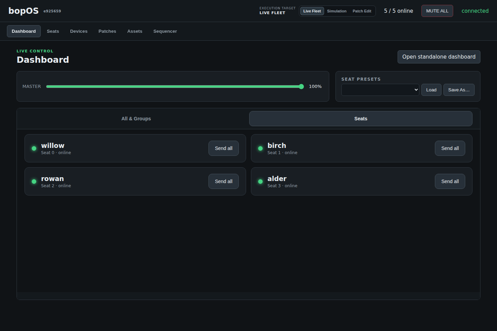

# Composing for bopOS

The complete path from an idea to sound on the fleet: create a patch on
your laptop, hear it in simulation, and deploy it from the dashboard. **No
Git knowledge is needed anywhere in this guide** — version control is an
optional advanced workflow with [its own section](#advanced-workflow-with-git)
at the end.

## What is a patch?

A patch is **one folder** holding your piece: the program your sound engine
runs, plus a small manifest file telling bopOS how to start it and what can
be controlled.

```text
patches/
  my-piece/
    bopos.patch.json    ← the manifest (required)
    main.pd             ← your entry point (any name; declared in the manifest)
    …anything else your piece needs
```

Pure Data is the reference engine; SuperCollider works through exactly the
same boundary. The repository ships two copyable starting points:
[`patches/demo-pd/`](../patches/demo-pd/) and
[`patches/demo-sc/`](../patches/demo-sc/).

## What you need running locally

| tool | why |
|---|---|
| the bopOS repo + dashboard | authoring, audition, and deployment all happen here — setup is in [Getting started](GETTING-STARTED.md) |
| Pure Data (vanilla) | to edit your patch and to hear it in simulation |
| your ears | simulation runs real engine instances on the laptop, spatially mixed |

You do **not** need a Raspberry Pi to compose. The fleet can be simulated
until the day you deploy.

## Step 1 — create the patch

Two equally good ways:

**Copy a demo** (in your file manager or a terminal):

```sh
cp -r patches/demo-pd patches/my-piece
```

**Or let the dashboard scaffold it:** open the **Patches** tab and press
**New patch…**. It creates the folder, writes a valid manifest, and copies
the Pure Data template stub as your `main.pd`.

Your folder under `patches/` is yours — the bopOS repository deliberately
ignores it, so nothing you do there can tangle with the framework.

## Step 2 — declare what it is (the manifest)

`bopos.patch.json` is the single source of truth for your patch. The
dashboard's **Patches** tab edits it with a form (press **Save manifest**
when done), or edit the JSON directly:

```json
{
  "engine": "pd",
  "entrypoint": "main.pd",
  "params": [
    { "name": "density", "type": "f", "min": 0, "max": 1,
      "default": 0.5, "dashboard": true }
  ],
  "cues": [
    { "id": "snap", "label": "Snap", "description": "Fire the snap gesture" }
  ],
  "caps": [],
  "slots": []
}
```


Line by line:

- **`engine` / `entrypoint`** — what starts your patch. `"pd"` +
  `"main.pd"` for Pure Data; `"sc"` patches declare their own entry point.
- **`params`** — every control the dashboard may offer. Each declared
  parameter becomes a rendered control; the dashboard never invents
  sliders. Add `"dashboard": true` to promote a parameter onto the live
  **Dashboard** tab for performance-time control. An optional `"path"`
  array nests parameters (`{"path": ["texture"], "name": "density"}`
  arrives as `/p/texture/density`).
- **`cues`** — named actions your patch responds to. Declared cues appear
  as synchronized trigger buttons in the dashboard and fire tightly across
  the whole fleet.
- **`slots`** — names of the [asset slots](#step-6--big-media-assets) your
  patch reads.

A missing or invalid manifest fails launch **loudly** — there is no silent
fallback, so a typo shows up on your laptop, not at the venue.

## Step 3 — write the music

Open your entry point in Pure Data. Everything bopOS gives your patch
arrives through the `[bopos]` abstraction (from `pd/bopos.pd`), which
exposes labelled buses instead of raw networking:

| bus | what arrives |
|---|---|
| `bopos-param` | your declared parameters, e.g. `density 0.5` |
| `bopos-point` | spatial proximity per moving point and element, 0→1 |
| `bopos-cue` | named cue fires, already synchronized |
| `bopos-master` | the venue master level |
| `bopos-context` | seed, run ID, patch name, asset-slot folder list — at launch |
| `bopos-io` | sensor data, if you use I2C peripherals |

Finish your signal chain through `[bopos.out~]`: it applies master level
and audition preview correctly at the output boundary so you never wire
those by hand.

Two habits that keep patches portable:

- **Consume only what you use.** Ignoring a bus is legal — a patch that
  doesn't read `bopos-point` simply isn't spatial, and nothing errors.
- **The value is yours to interpret.** Point proximity can drive gain, a
  filter, a rhythm — bopOS provides the number and never decides what it
  means.

The full engine surface (and how non-PD engines consume it) is contract
[§4.2](OSC-CONTRACT.md).

## Step 4 — hear it

In the dashboard header, switch the **Execution target** from **Live
fleet** to **Simulation** and confirm. The dashboard launches real engine
instances of the selected patch on your laptop — one per simulated seat —
and mixes them spatially. Drag the white listener puck around the **Seats**
map to hear the room from any position; edit its heading above the map.

While simulating, every dashboard control behaves exactly as it will at the
venue: parameters, cues, points, master. Live fleet devices are never
driven in this mode.

> macOS (CoreAudio) is the well-trodden audition platform; Linux uses JACK
> and is less exercised. Real-room acoustics are, of course, not simulated.

## Step 5 — put it on the fleet

When real nodes are on the network (see [INSTALL.md](INSTALL.md)) and the
Execution target is **Live fleet**:

1. Open the **Patches** tab.
2. Pick your patch in the **Fleet patch** selector. (Just edited files
   outside the browser? **Refresh catalog** first.)
3. Press **Deploy as fleet patch** and confirm.

The dashboard converges every online assigned device to your exact bytes —
transfers are diff-based, resumable, and hash-verified — then restarts
their engines into the new patch. Row badges show each node's convergence,
and selecting a row shows its observed inventory with **Retry** /
**Re-switch** if a node needs another nudge. **Revert** stages the previous
fleet patch back through the same flow.

The whole fleet plays one patch; per-device patch mixtures are deliberately
not a supported mode.

## Step 6 — big media (assets)

Sample libraries and other large media don't live inside your patch folder.
Put them in a named **slot** under `assets/` on the dashboard machine:

```text
assets/
  my-piece-samples/
    voices/
    textures/
```

Declare the slot in your manifest (`"slots": ["my-piece-samples"]`), send it
from the **Assets** tab (one device at a time — select the target device,
then **Send**), and select its absolute folder path from the asset-slot list
that arrives on `bopos-context` at launch. Adding or removing a slot changes
that list on the next engine start; updating files inside an already-listed
slot remains visible in place. Keeping media out of the patch keeps deploys
fast: sending a one-line patch fix never re-ships gigabytes.

[assets/README.md](../assets/README.md) covers slot naming, updating in
place, and safe side-by-side revisions.

## Step 7 — perform

The **Dashboard** tab (or **Open standalone dashboard** on a tablet) is the
show surface: master, MUTE ALL, seat presets, your promoted parameters at
All / Group / Seat scope, and your declared cue triggers.



Nodes persist everything they've been given — assignment, patch, values —
so once configured, the installation runs with the dashboard (and the whole
network) switched off.

## Advanced workflow with Git

Everything above works with plain folders. If you want version control for
your patch, your patch folder can also be an independent Git repository —
useful for collaboration and history, never required.

- Your repo lives at `patches/my-piece/` as before; bopOS ignores it either
  way. Author, commit, and push however you like.
- A device-side patch copy is **either** host-mirrored (the Deploy flow
  above) **or** Git-managed — never both. Deploy refuses to overwrite a
  device patch containing `.git`, so the two modes can't silently mix.
- To run Git-managed on devices, install the patch from its GitHub remote
  with the dashboard's add-patch action (wire verb `/os/addpatch`), and
  update devices with **Pull latest** (`/os/pullpatch`), which appears for
  the active Git-managed patch (marked ◆) in the Patches tab.
- Git-managed deployment needs the nodes to reach the remote — remember
  the [venue network](INSTALL.md#the-venue-network) is often offline; the
  host-mirror Deploy flow works air-gapped.

## Quick reference

| I want to… | where |
|---|---|
| start a new patch | **Patches → New patch…**, or copy `patches/demo-pd/` |
| declare a control | manifest `params` (+ `"dashboard": true` for live use) |
| hear my patch now | Execution target → **Simulation** |
| ship to the fleet | **Patches →** select **→ Deploy as fleet patch** |
| ship big media | `assets/<slot>/` + **Assets → Send** |
| fire a synchronized event | manifest `cues` + the Dashboard cue trigger |
| undo a deploy | **Patches → Revert** |
