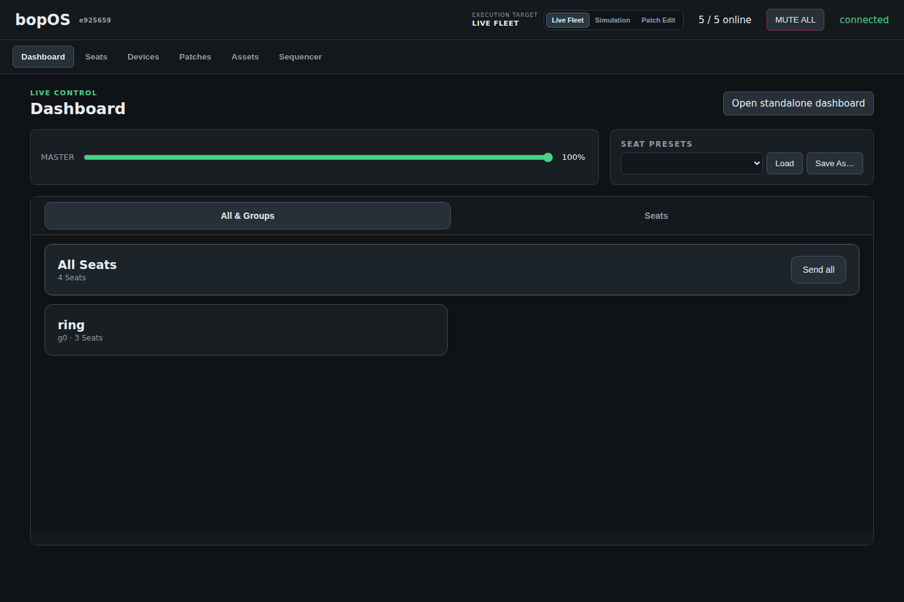
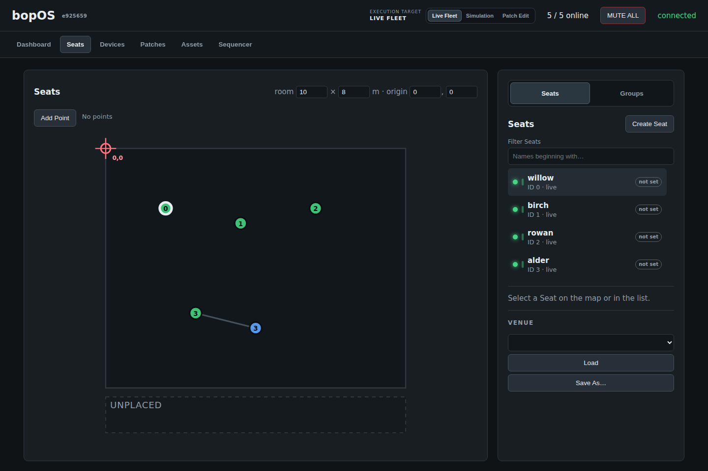
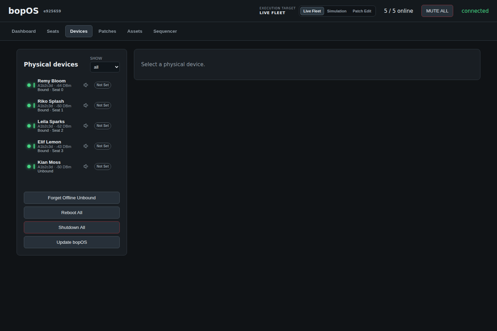
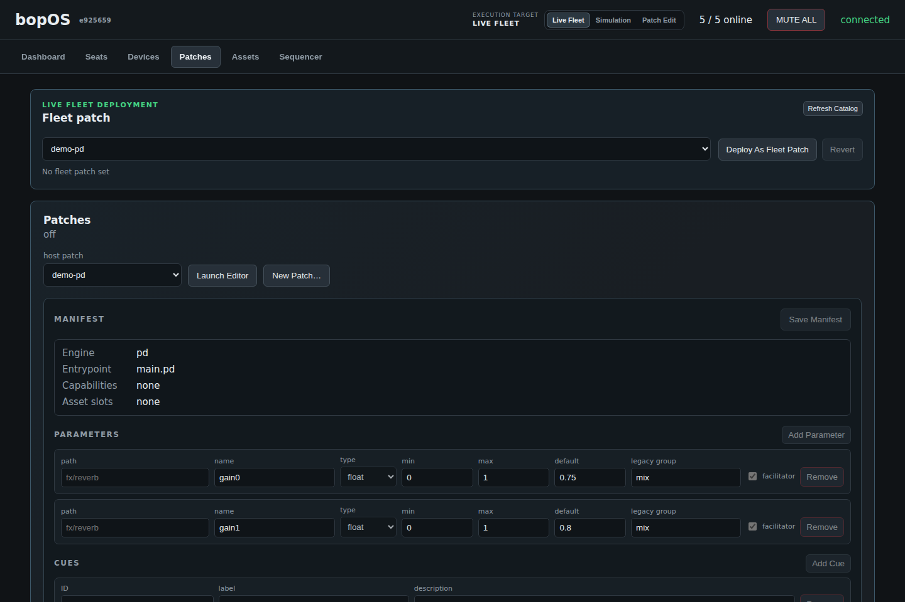

# Getting started

The shortest path to a working bopOS system: a simulated five-node fleet and
the real dashboard, on one laptop, in about ten minutes. No Raspberry Pi, no
audio hardware, nothing to solder.

## What you need

- a laptop with **Python 3.11+** and **Git**
- any modern browser

That's it for the simulated tour. Real sound and real hardware come later,
each with its own guide.

## 1. Clone and set up

```sh
git clone --recursive https://github.com/zealtv/bopOS.git
cd bopOS

python3 -m venv ~/.venvs/bopos
~/.venvs/bopos/bin/pip install -r dashboard/requirements.txt
```

Or just run `./install.sh` from the repo root, which does the two lines above
for you. Then `./run.sh` starts the dashboard (it stands in for the
`server.py` command in step 2 — add a simulated fleet in a second terminal as
below).

## 2. Start the dashboard and a simulated fleet

Two terminals, both from the repo root.

Terminal 1 — the dashboard:

```sh
~/.venvs/bopos/bin/python dashboard/server.py
```

Terminal 2 — five fake nodes speaking the real protocol:

```sh
~/.venvs/bopos/bin/python tools/simfleet.py --devices 5
```

Open <http://localhost:8080/>. Within a couple of seconds the header shows
**5 / 5 online** — the simulated nodes were discovered from their heartbeats,
exactly the way real Pis are.

## 3. Look around

The application is six tabs. Left to right, roughly "perform → place →
maintain":



**Dashboard** is the live-performance surface: the master fader, MUTE ALL,
seat presets, and whichever patch parameters the active patch has promoted
for live control. **Open standalone dashboard** gives the same surface as a
full-screen page for a tablet at the venue.



**Seats** is where the piece meets the room: a scaled floor plan where each
Seat's speaker elements are dragged into position, moving points are
authored, groups are managed, and venue snapshots are saved and loaded.



**Devices** is the hardware roster: every physical box that has ever
heartbeated, its binding to a Seat, signal strength, per-device mute, and
maintenance actions (identify, reboot, update). Unassigned devices — like
the fifth simulated node here — wait in this list until bound to a Seat.



**Patches** manages what the fleet plays: pick a patch from the host
catalog, **Deploy As Fleet Patch** to converge every node to it, and edit
patch manifests — parameters, cues, capabilities — right in the browser.

**Assets** delivers big media (sample packs, textures) to one device at a
time and shows exactly what each box has installed. **Show** is the
performance-control surface: author steps of OSC messages with durations
and follow actions, play them against the fleet, and watch the outgoing
and incoming OSC consoles.

## 4. Try the loop

A two-minute exercise to feel the system move:

1. In **Devices**, find the unassigned node and bind it to a new Seat.
2. In **Seats**, drag its element somewhere on the map.
3. In **Seats**, press **Add Point** and drag the point near that element —
   the simulated node computes its proximity value just like a real one.
4. On the **Dashboard** tab, pull the master fader down and back up.
5. Press **MUTE ALL**, then release it. Safe, idempotent, and instant — this
   is the one control the framework owns end-to-end.

Everything you just did used the real wire protocol; only the audio was
missing.

## Where next

- **Hear it** — `tools/audition.py` runs real engine instances on your
  laptop, spatially mixed, against the same dashboard
  ([dashboard/README.md](../dashboard/README.md) has the recipe). Requires
  Pure Data installed locally; macOS is the well-trodden platform.
- **Write your own patch** — [COMPOSING.md](COMPOSING.md), the composer
  guide. Copy a demo, edit, deploy; no Git required.
- **Build a real node** — [INSTALL.md](INSTALL.md): flashing a Pi, the
  venue network recipe, and first boot.
- **Understand the machinery** — [ARCHITECTURE.md](ARCHITECTURE.md), a
  ten-minute tour of how it all fits together.
