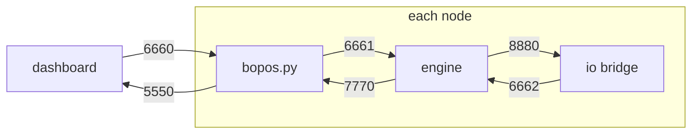

# Port map

Every UDP port bopOS uses, on one page. This is a quick reference; the
normative table and transport rules are [OSC-CONTRACT.md §4](OSC-CONTRACT.md).
Ports are fixed in production — nothing here is configurable per venue.

## The six ports

Only two ports ever cross the network. The other four are localhost plumbing
inside each node.

| port | scope | listener | sender | carries |
|---:|---|---|---|---|
| **5550** | LAN | dashboard | `bopos.py` on every node | heartbeats, status, command replies |
| **6660** | LAN | `bopos.py` (sole binder) | dashboard | fleet commands, cues, point frames |
| 6661 | localhost | active engine | `bopos.py` | the selector-stripped engine surface |
| 6662 | localhost | active engine | `io/main.py` | bundled peripheral sensor data |
| 7770 | localhost | `bopos.py` | active engine | engine requests: config, store, load, report |
| 8880 | localhost | `io/main.py` | active engine | peripheral and I/O commands |

## Rules worth remembering

- **`bopos.py` is each node's only LAN citizen.** Engines and patches never
  bind 6660 or send on 5550 — engine death therefore never looks like node
  death.
- **Broadcast vs unicast:** 6660 traffic is broadcast only for genuinely
  one-to-many, low-rate, idempotent messages (heartbeat requests, cues,
  point frames, mute, master). All request/reply traffic returns unicast to
  the requester on 5550.
- **Audition instances move the number, not the shape:** a preview engine on
  the laptop is assigned its own port via `BOPOS_ENGINE_PORT` and receives
  exactly the same selector-free surface as a production engine on 6661.
- **Firewalls:** the dashboard machine must accept UDP 5550 inbound and be
  able to broadcast UDP 6660 on the installation network.
